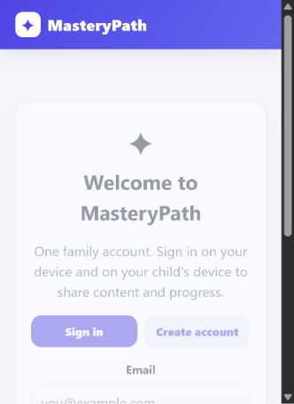
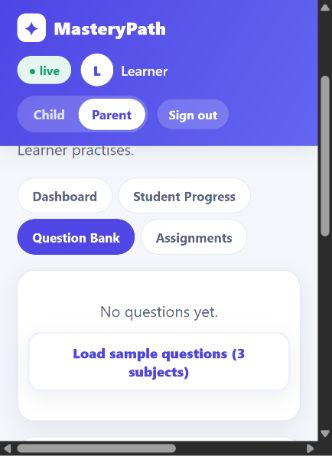

# MasteryPath

> A deployed, cloud-backed adaptive learning platform that turns validated lesson content into progressive, skill-aware practice—and helps a parent monitor genuine understanding from anywhere.

[**Open the live app**](https://ibkwilliams1.github.io/mastery-path/) · **Repository:** `mastery-path`

MasteryPath is a working product built from a real remote-learning need. It combines AI-assisted question-bank creation, human validation, adaptive assessment, skill-level progress tracking, and parent-facing insight in a single subject-agnostic web application.

From a portfolio perspective, the project demonstrates the complete journey from **problem discovery and requirements definition** through **data modelling, decision-engine design, cloud architecture, privacy controls, deployment, and evidence-led iteration**.

It began with mathematics for one child, but its architecture is deliberately designed to expand across subjects:

```text
MasteryPath
├── Math Mastery
├── English Mastery
├── Science Mastery
└── Future subject modules
```

## Project at a glance

| Area | Implementation |
|---|---|
| **Problem addressed** | Remote, evidence-based monitoring of a learner's progress across devices |
| **Product model** | Learner → Subject → Topic → Skill → Difficulty → Attempt → Mastery |
| **Decision engine** | Configurable Promote / Reinforce / Remediate recommendations |
| **Cloud workflow** | Supabase Auth, Postgres, Row Level Security, and Realtime |
| **AI boundary** | AI assists question creation; a human validates content before use |
| **Delivery** | Static application deployed publicly through GitHub Pages |
| **Current scope** | Mathematics, English, and Science, with room for additional subjects |

## Product views

<table>
  <tr>
    <td align="center" width="50%">
      <br>
      <strong>Shared family access</strong><br>
      <sub>One authenticated account supports the parent and learner across devices.</sub>
    </td>
    <td align="center" width="50%">
      <br>
      <strong>Parent-controlled content workflow</strong><br>
      <sub>The parent area manages validated content before it reaches the learner.</sub>
    </td>
  </tr>
</table>

The responsive interface separates learner practice from parent oversight while keeping both experiences connected to the same cloud-backed account.

---

## Purpose

MasteryPath exists to answer a more useful question than *“How many questions did the learner answer?”*

> What has the learner genuinely understood, where are the remaining gaps, and what should they practise next?

The platform turns lessons into measurable learning outcomes. It helps a parent or trusted reviewer prepare relevant practice content, monitor understanding **remotely**, identify weak skills, and intervene with greater precision.

---

## Origin and product journey

The project started as a practical way to support a child taking online lessons from another city. The initial workflow was simple: take a lesson video, use an AI tool such as Gemini or NotebookLM to generate questions grounded in that lesson, review them, and let the child practise until the system had credible evidence of mastery.

Turning that idea into a working product happened in three stages:

1. **Single-device prototype.** The first version was a self-contained web page that stored questions and progress in the browser’s local storage. It proved that the learning engine worked, but revealed a critical limitation: the data never left the device. A parent in one city could not see a child practising in another, and imported questions did not travel between devices.

2. **Remote workflow requirement.** Remote monitoring and shared content were central to the use case. Meeting that requirement needed a shared cloud data layer and authenticated access. The app was therefore rebuilt with **Supabase**, allowing questions, attempts, sessions, and progress to persist in the cloud and remain available across devices.

3. **Generalisation and launch.** With the cloud architecture in place, the application evolved from “Math Mastery” into **MasteryPath**: a subject-agnostic platform built around the model Learner → Subject → Topic → Skill → Difficulty. It was then deployed publicly through GitHub Pages.

A central principle survived every stage: **AI assists with content preparation, but does not replace human judgment.** A parent or trusted reviewer validates generated questions before a learner sees them. NotebookLM is the current generation tool, not a permanent dependency; MasteryPath is the learning engine that consumes validated question banks.

---

## How Supabase fits in

MasteryPath’s frontend is a static web application. Everything that needs to be **shared, private, and persistent** is handled by [Supabase](https://supabase.com), making remote monitoring possible.

| Responsibility | Supabase feature | What it enables |
|---|---|---|
| **One family login** | Supabase Auth (email and password) | The same account can sign in on the parent’s and learner’s devices in different locations. |
| **Shared, durable data** | Postgres database | Questions, attempts, sessions, and settings sync across devices and survive browser restarts. |
| **Privacy by design** | Row Level Security (RLS) | Each row is scoped to its owner, so an authenticated account can access only its own data. |
| **Live parent monitoring** | Supabase Realtime | The parent dashboard can update as the learner answers, without a manual refresh. |

The database is intentionally small and explainable:

```text
app_settings   one row per family: learner profile, assignments, review schedule, settings
questions      approved questions: subject, topic, skill, difficulty, options, answer
sessions       one row per practice, diagnostic, or review session
attempts       one row per answered question—the raw evidence used by the mastery engine
```

Because mastery is **computed from the attempts log** rather than stored only as a frozen score, the decision rules can evolve without rewriting the learner’s history.

---

## Implemented architecture

```text
Content preparation
  Lesson / video → NotebookLM (AI generation) → CSV → in-app validation and approval

Frontend (this repository)
  Single self-contained index.html—HTML, CSS, and vanilla JavaScript; no build step
  Learner experience → subject picker → adaptive quiz
  Parent experience  → dashboard → question bank → assignments
  Framework-free mastery engine → levels → mastery → weak skills → decisions

Cloud (Supabase)
  Auth (family login) · Postgres (shared data) · RLS (privacy) · Realtime (live updates)

Hosting
  GitHub Pages serves the static app at a public URL
```

Deliberate architectural boundaries include:

- The AI generation provider remains replaceable; NotebookLM is not embedded in the learning engine.
- Generated content is separated from **approved** content, so nothing reaches a learner without review.
- Assessment delivery is separated from mastery calculation.
- The evidence behind each mastery decision is retained in the attempt history.
- Parent/reviewer and learner access are distinct; a PIN guards the parent view.
- Mastery rules can evolve without rewriting historical attempts.

---

## Learning structure

```text
Learner
└── Subject
    └── Topic
        └── Skill
            └── Difficulty (5 levels)
                └── Question
                    └── Attempt
                        └── Mastery
```

For example: *Learner → Mathematics → Fractions → Comparing fractions → Foundation … Challenge.* The same structure supports English grammar, science concepts, and future subjects without redesigning the core engine.

### Five difficulty levels

| Level | Name | Intended demand |
|---:|---|---|
| 1 | Foundation | Direct recognition, recall, and simple one-step application |
| 2 | Basic | Familiar application with modest variation and growing independence |
| 3 | Intermediate | Multi-step work, word problems, and combinations of related ideas |
| 4 | Advanced | Harder reasoning, less obvious solution paths, and more demanding application |
| 5 | Challenge | Deep understanding demonstrated through difficult multi-step or multi-part problems |

Question design increases **reasoning demand**, not merely number size. Distractors are intended to be plausible and, where possible, reflect common learner mistakes. This creates a foundation for future misconception detection as well as correctness scoring.

---

## The adaptive engine

The engine is implemented as a set of pure functions over the `attempts` log, keeping its decisions transparent and portable. Calculations are subject-scoped, so progress in an English topic never affects a Mathematics topic.

- **Adaptive difficulty:** five levels, with promotion after sustained accuracy of approximately 80% over a recent window and regression when recent accuracy falls below approximately 60%.
- **Mastery score:** a weighted blend of recent accuracy, difficulty achieved, consistency, retention, and response confidence. These are configurable product rules, not universal educational claims.
- **Skill-aware analysis:** accuracy is tracked by sub-skill so that a strong topic average cannot conceal a specific weakness.
- **Explainable decisions:** after a meaningful evidence window, the engine gives one of three plain-language recommendations:
  - **Promote** — evidence is sufficient to introduce the next difficulty level.
  - **Reinforce** — overall performance is promising, but a specific skill needs targeted practice at the current level.
  - **Remediate** — sustained difficulty indicates a need to step down or rebuild a prerequisite.
- **Spaced repetition:** mastered topics return for review at widening intervals, while weak review performance shortens the interval.

All thresholds are held in one configuration block and are intended to be refined through real-world use.

---

## Content workflow

```text
Lesson / video content
      ↓
AI-assisted generation (currently NotebookLM)
      ↓
Structured CSV
      ↓
Parent validation and approval (in-app)
      ↓
Approved question bank (cloud)
      ↓
Adaptive assessment
      ↓
Attempt and sub-skill analysis
      ↓
Mastery decision (Promote / Reinforce / Remediate)
      ↓
Parent dashboard and targeted intervention
```

### Question CSV schema

```csv
subject,topic,skill,difficulty,question,option_a,option_b,option_c,option_d,answer,explanation
```

The in-app importer checks structure before saving, including missing fields, invalid difficulty values, invalid answer letters, and duplicates. A human then approves the batch. Only approved records enter the live question bank.

---

## Using MasteryPath

1. Open the [live app](https://ibkwilliams1.github.io/mastery-path/) and create one family account, or sign in.
2. In the PIN-guarded **Parent** area, open **Question Bank**, paste a NotebookLM CSV, select **Validate**, and then **Approve**. Set the starting difficulty for each topic under **Assignments**.
3. The learner signs in on their own device using the same family account, chooses a **subject** and **topic**, and practises. The difficulty adapts automatically.
4. The parent follows the subject-level dashboard and uses the **Promote**, **Reinforce**, or **Remediate** guidance to support the learner.

---

## Privacy and child safety

MasteryPath processes a child’s educational data, so privacy is a core requirement rather than a later feature.

- Only data needed to operate the learning experience is collected.
- The account is parent-controlled, with learner and reviewer access separated.
- Row Level Security isolates each family’s data at the database level.
- Data is transmitted over HTTPS; the public Supabase key grants no unrestricted database access when RLS policies are correctly enforced.
- The app contains no advertising, public profiles, or chat.
- No real learner data, credentials, or private lesson content is committed to the repository; demonstration data is synthetic.

---

## Roadmap

### Phase 1 — Foundation

- [x] Subject-neutral domain model: Learner → Subject → Topic → Skill → Difficulty
- [x] Five-level, subject-agnostic generation specification
- [x] Question-bank CSV contract
- [x] Import, validation, review, and approval workflow
- [x] Math Mastery as the first subject module, followed by English and Science

### Phase 2 — Mastery engine

- [x] Record attempts at topic, skill, and difficulty level
- [x] Configurable promotion and regression criteria
- [x] Weak-skill detection
- [x] Explainable Promote / Reinforce / Remediate decisions
- [ ] Complete minimum-attempt and full sub-skill coverage gating
- [ ] Persist decision history over time

### Phase 3 — Parent insight

- [x] Decision-oriented parent dashboard
- [x] Weak-skill and review-due highlighting
- [x] Live monitoring across devices
- [ ] Progress and mastery trend charts
- [ ] Scheduled progress summaries, such as a weekly email

### Phase 4 — Expansion

- [x] Multi-subject support through question-bank imports
- [ ] Subject-specific question and response formats
- [ ] Misconception detection from distractor patterns
- [ ] Evaluation of additional generation providers

### Phase 5 — Product hardening

- [ ] Validate mastery rules through real-world use
- [ ] Improve accessibility and age-appropriate UX
- [ ] Add retention, backup, and recovery controls
- [ ] Add automated quality checks and monitoring

---

## Tech stack

- **Frontend:** single-file HTML, CSS, and vanilla JavaScript; no build step
- **Cloud:** Supabase—Postgres, Auth, Row Level Security, and Realtime
- **Hosting:** GitHub Pages
- **Content generation:** NotebookLM as an external, replaceable tool feeding a reviewed CSV import

---

## Engineering and career trajectory

MasteryPath is an education-focused product, not a petroleum or laboratory application. For recruiters and technical reviewers, its broader significance is the **transferable engineering approach** demonstrated by taking it from a personal need to a deployed system:

```text
Real operational problem
  → product requirements
  → domain and data model
  → decision logic
  → secure cloud-backed workflow
  → working deployment
  → evidence-led iteration
```

The project was created by an experienced petroleum laboratory professional and technical signatory progressing toward laboratory leadership while developing capability in software, data engineering, cloud/DevOps, automation, and applied AI. It provides tangible evidence of that progression without presenting an education product as an industrial solution or overstating the creator's current technology experience.

Specifically, the project demonstrates the ability to:

- identify a real workflow constraint—in this case, supporting and monitoring learning across different locations;
- translate that constraint into functional requirements for shared data, authentication, privacy, and live visibility;
- design a reusable domain model rather than hard-code the product around its first subject;
- turn educational policy into configurable, explainable decision logic;
- combine AI-assisted preparation with human validation and clear system boundaries;
- implement a persistent cloud-backed workflow and deploy a functioning product; and
- refine rules and priorities from observed evidence rather than treating the first design as final.

This is the same problem-solving pattern the creator intends to apply—within the limits of growing experience—to **digital laboratory systems, laboratory informatics, industrial data and automation, and technology-enabled operations**. In those environments, the subject matter and controls are different, but the engineering questions are related: how should data move, where should validation occur, which decisions can be automated, how should evidence remain traceable, and how can users see the information needed to act?

### Transferable engineering evidence

| Engineering behaviour | Evidence in MasteryPath |
|---|---|
| **Start from an operational need** | Remote support and visibility were treated as core requirements, not optional features. |
| **Model the domain for change** | The original mathematics concept became a reusable learner/subject/topic/skill/difficulty model. |
| **Design around traceable evidence** | Attempts remain the source history from which mastery and recommendations are calculated. |
| **Separate automation from judgment** | AI-generated questions remain outside the approved bank until human validation. |
| **Choose technology to meet requirements** | Supabase was introduced when the local-storage prototype could not support shared, multi-device workflows. |
| **Deliver and iterate** | The application is publicly deployed, used as a working product, and refined through observed outcomes. |

MasteryPath therefore serves as both a working education product and a portfolio case study in dependable, human-centred digital workflow design. It connects established laboratory discipline and operational judgment with a growing ability to design and deliver software-enabled systems.

The intended career direction is toward work where this combination is valuable: **digital laboratory systems, laboratory informatics, industrial data and automation, and technology-enabled operations**. The project does not claim mastery of those fields; it shows the creator actively building the underlying software, data, cloud, automation, and systems-thinking capabilities needed to contribute to them.

---

## Project status

MasteryPath is live and in active development. Mathematics, English, and Science modules are working, backed by Supabase and deployed through GitHub Pages. Roadmap priorities and decision thresholds will continue to be refined through real-world use.

## License

No license has been selected. Until a license file is added, all rights remain with the project owner.
